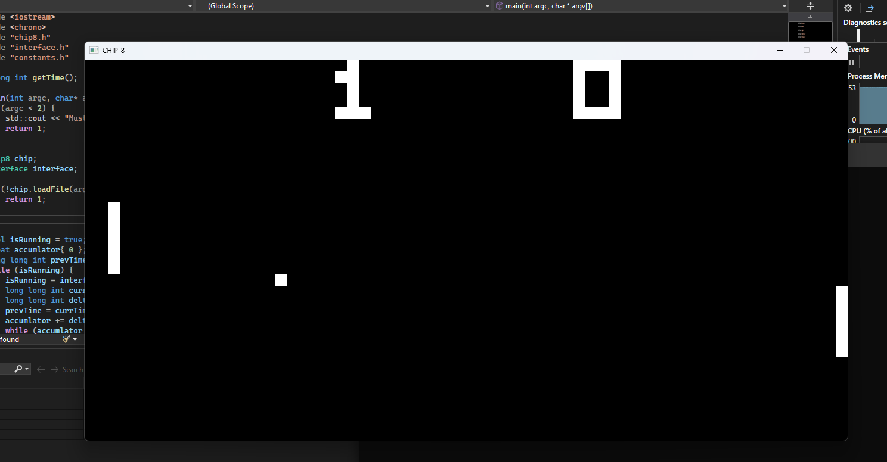
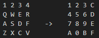

# CHIP-8 Emulator

## Description

This is an emulator/intrepreter for the [CHIP-8](https://en.wikipedia.org/wiki/CHIP-8) system.  I developed this project as I have alwasy had a love for emulators and wanted to get into developing my own emulators.

This project is developed completly in C++ and makes use of the SDL2.0 library for input and output. This project also uses the C++ RAII paradigm along with object-oriented programming to ensure clean code.

This project aims to emulate the CPU cycle of the original CHIP-8 systems. The steps to emulate these are Fetch (get an opcode from memory), decode (figure out which opcode it is), and execute (run that opcode properly)

Later in the process the decode step was changed from using a giant switch statement to [function pointers](https://www.geeksforgeeks.org/cpp/function-pointer-in-cpp/) and [X macros](https://en.wikipedia.org/wiki/X_macro). This was mainly used to optimize the code not just for speed, but also readibility and expandibility. X macros make expanding the number of opcodes very simple by letting the programmer change the code in just one spot instead of many when adding a new opcode. This style is also commonly used on more advanced emulators.

Features:
* Support for base CHIP-8 roms
* Video output in black and white
* Audio output
* Keyboard input using the following QWERTY to Hex mapping: 

## How To Use
1. Download the current release [here](https://github.com/DAlexFunk/CHIP-8-Emulator/releases)
2. Extract the files into a place you can find
3. Run "CHIP-8 Emulator.exe" with the CHIP-8 rom (file extension .ch8) of your choice. One is provided in the download but more can be found in the tests directory [here](https://github.com/DAlexFunk/CHIP-8-Emulator/tree/v1.0.0/tests).  This is done in one of two ways
    * Either use the command prompt to run the exe with the rom as an argument.
    * Drag the rom over the exe and it will run with that file
4. If your operating system stops running the file as it is unrecognized you can ignore this (I wouldn't give you a virus)
5. Play your rom of choice! (if you are playing pong move up and down with HEX 1 and 4 which is 1 and Q on your keyboard)

Note: because of how the way CHIP-8 updates and renders the screen, screen flickering is common in most roms for CHIP-8. This is ***not*** a bug and how CHIP-8 worked.

## Credits
* [Tobais Langhoff](https://tobiasvl.github.io/blog/write-a-chip-8-emulator/#prerequisites) for providing a great overview of the CHIP-8 system.
* [SDL2.0](https://www.libsdl.org/) for the audio/video output and keyboard input.
* [Timendus](https://github.com/Timendus/chip8-test-suite) for providing the test suite for the emulator
* [This repo](https://github.com/kripod/chip8-roms/tree/master/games) and [this site](https://johnearnest.github.io/chip8Archive/?sort=platform) for providing the CHIP-8 games provided.